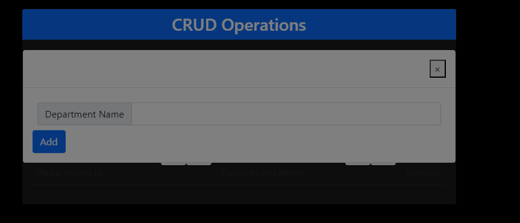

# Angular/.Net CRUD Assigment

## Team Members [Employee ID]

- Shubham Golwal [1041941]
- Tanisha Gondke [1041938]
- Nanditha Nambiar [1041750]
- Shivani Prasad [1041409]

## Tech Stack

- Frontend: Angular
- Backend: .NET
- Database: SQL Server Management Studio (SSMS)

## Features

### Home Page

The home page provides options for managing both Departments and Employees.

### Department Management

- **Show Departments**: View a list of all departments.

  - CRUD Operations: Read (GET)

- **Add Department**: Create a new department.
  - CRUD Operations: Create (POST)

### Employee Management

- **Show Employees**: View a list of all employees.

  - CRUD Operations: Read (GET)

- **Edit Employee**: Modify existing employee information.
  - CRUD Operations: Update (PUT)

## CRUD Operations

### Departments

1. **Create (POST)**: Add a new department through the "Add Department" feature.
2. **Read (GET)**: Retrieve and display all departments in the "Show Departments" list.
3. **Update (PUT)**: Edit department information (not shown in screenshots, but typically available).
4. **Delete (DELETE)**: Remove a department (not shown in screenshots, but typically available).

### Employees

1. **Create (POST)**: Add a new employee (not shown in screenshots, but typically available).
2. **Read (GET)**: Retrieve and display all employees in the "Show Employees" list.
3. **Update (PUT)**: Modify employee information using the "Edit Employee" feature.
4. **Delete (DELETE)**: Remove an employee (not shown in screenshots, but typically available).

## Screenshots

### Home Page

### Show Departments

### Add Department

### Show Employees

### Edit Employee

# Database

#DB Query
use EmployeeDB

CREATE TABLE [dbo].[Employee](
[EmployeeID] [int] IDENTITY(1,1) NOT NULL,
[EmployeeName] [varchar](500) NULL,
[Department] [varchar](100) NULL,
[EmailId] [nvarchar](500) NULL,
[DOJ] [date] NULL,
CONSTRAINT [PK_Employee] PRIMARY KEY CLUSTERED
(
[EmployeeID] ASC
)WITH (PAD_INDEX = OFF, STATISTICS_NORECOMPUTE = OFF, IGNORE_DUP_KEY = OFF, ALLOW_ROW_LOCKS = ON, ALLOW_PAGE_LOCKS = ON, OPTIMIZE_FOR_SEQUENTIAL_KEY = OFF) ON [PRIMARY]
) ON [PRIMARY]
GO

CREATE TABLE [dbo].[Department](
[DepartmentID] [int] IDENTITY(1,1) NOT NULL,
[DepartmentName] [varchar](50) NULL,
CONSTRAINT [PK_Department] PRIMARY KEY CLUSTERED
(
[DepartmentID] ASC
)WITH (PAD_INDEX = OFF, STATISTICS_NORECOMPUTE = OFF, IGNORE_DUP_KEY = OFF, ALLOW_ROW_LOCKS = ON, ALLOW_PAGE_LOCKS = ON, OPTIMIZE_FOR_SEQUENTIAL_KEY = OFF) ON [PRIMARY]
) ON [PRIMARY]
GO
